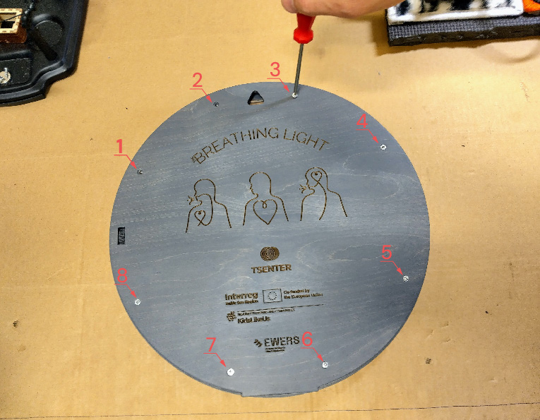
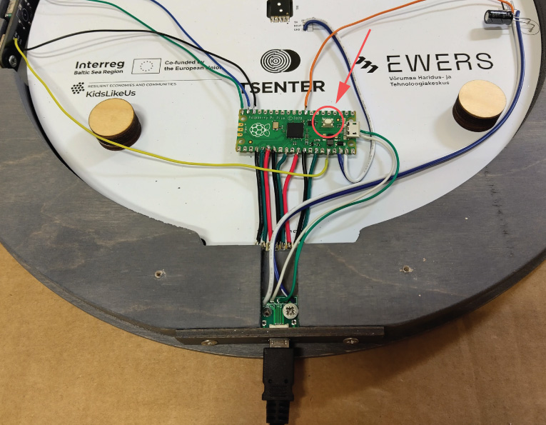

# Install Firmware

## 0

Download [firmware.uf2](./firmware.uf2) file

## 1

Unscrew the back cover

## 2

Hold down the button and at the same time connect the USB to the PC

## 3

Drag and drop firmware.uf2 file

## 4

Screw the back cover on and it's ready!

## 5

Read the [user manual](https://raw.githubusercontent.com/taunoe/breathing-light/refs/heads/main/img/ENG_kasutusjuhend.pdf).

The end!
