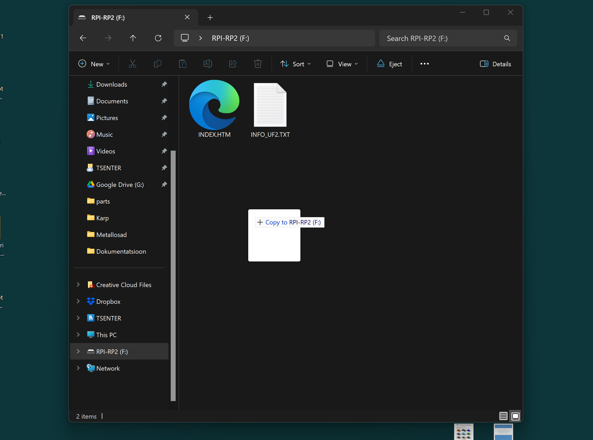

# Install Firmware

## Step 1

Download [firmware.uf2](https://github.com/taunoe/breathing-light/raw/refs/heads/main/Firmware/firmware.uf2) file

## Step 2

Unscrew the back cover

## Step 3

Hold down the button and at the same time connect the USB to the PC

## Step 4

Drag and drop firmware.uf2 file to RPI-RP2 drive

## Step 5

Screw the back cover on and it's ready!

## Step 6

Read the [user manual](https://raw.githubusercontent.com/taunoe/breathing-light/refs/heads/main/img/ENG_kasutusjuhend.pdf).

The end!
